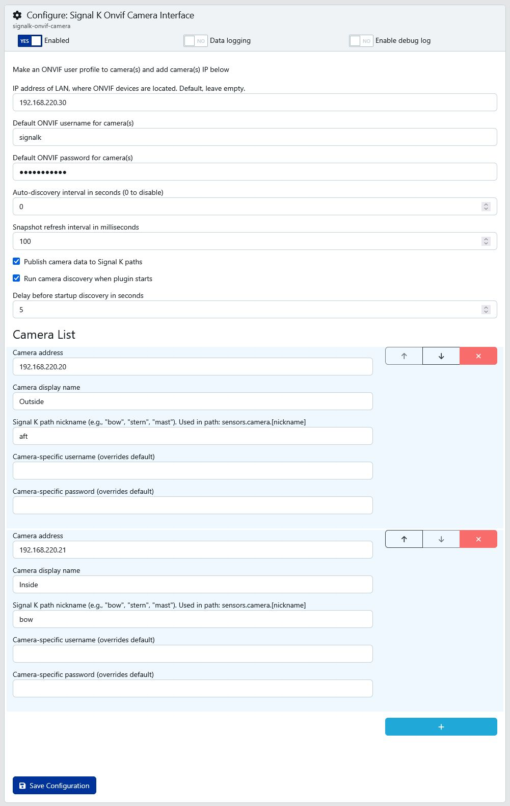
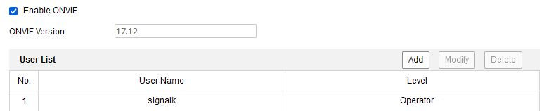
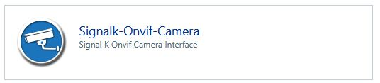
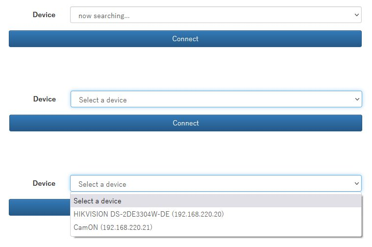
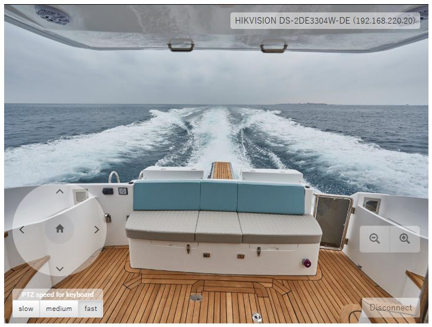

# signalk-onvif-camera

ONVIF Camera interface for Signal K. For IP cameras that support ONVIF control, fixed and PTZ.

## Installation

Install via the Signal K Appstore, or manually:

```bash
npm install signalk-onvif-camera
```

## Plugin Configuration



- Enter ONVIF profile username and password
- Add camera IP addresses to the list

## ONVIF Camera Setup

Example of HikVision IP camera ONVIF configuration:



- Add an ONVIF user to your IP camera if applicable

## Webapp



Access the webapp from the Signal K Webapps menu by selecting "Signalk-onvif-camera".

## Camera Service



- ONVIF cameras are discovered on the local network
- Select a device from the dropdown menu
- Press "Connect" to connect to the camera

## Camera Controls



- PTZ controls: pan, tilt, and home button
- Zoom in/out
- Adjustable control speed
- Disconnect
- Hide/show controls

## Development

```bash
npm install
npm run build       # Build frontend (cleans public/ first)
npm run dev         # Vite dev server
npm test            # Run tests with coverage
npm run lint        # Lint with ESLint
```

## Version control

- v0.0.1, 1st version for testing
- v0.0.2, license added
- v0.1.0, 1st release
- v0.1.1, ONVIF LAN selection
- v0.1.2, Webpack bundled
- v0.1.3, Webapp icon added
- v0.1.4, updated to npm packages
- v0.2.0, hide controls
- v0.2.1, version update
- v0.3.0, ws error handling
- v0.3.1, icon loading error
- v0.4.0, code refactoring
- v0.5.0, improvements to streaming and viewing
- v0.6.0, replace devcert with selfsigned
- v0.6.1, extra console logs removed
- v0.7.0, certs stored to permanent location
- v0.7.1, fix WebSocket connection issues
- v0.8.0, webpack changed to vite
- v1.0.0: WebSocket noServer mode, build pipeline cleanup
- v1.1.0: migrated TypeScript, hardened ONVIF discovery, auth, snapshot/MJPEG streaming, reconnect and shutdown behavior
- v1.1.1: clean-up build output

## Credits

https://github.com/futomi/node-onvif

## License

MIT
