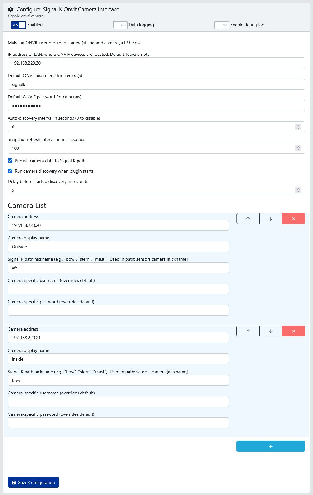
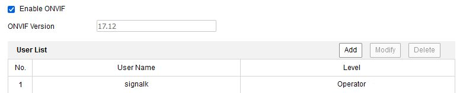
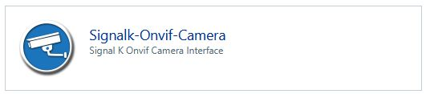
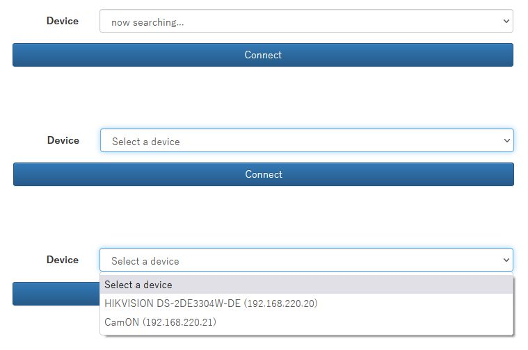
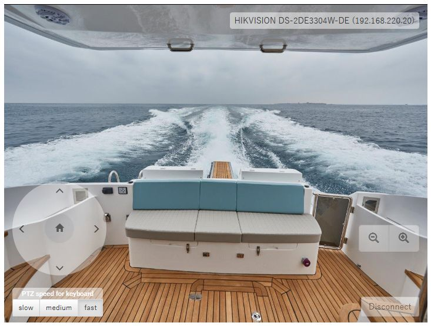

# signalk-onvif-camera

ONVIF Camera interface for Signal K. For IP cameras that support ONVIF control, fixed and PTZ.

## Installation

Install via the Signal K Appstore, or manually:

```bash
npm install signalk-onvif-camera
```

## Plugin Configuration



- Enter ONVIF profile username and password
- Add camera IP addresses to the list

## ONVIF Camera Setup

Example of HikVision IP camera ONVIF configuration:



- Add an ONVIF user to your IP camera if applicable

## Webapp



Access the webapp from the Signal K Webapps menu by selecting "Signalk-onvif-camera".

## Camera Service



- ONVIF cameras are discovered on the local network
- Select a device from the dropdown menu
- Press "Connect" to connect to the camera

## Camera Controls



- PTZ controls: pan, tilt, and home button
- Zoom in/out
- Adjustable control speed
- Disconnect
- Hide/show controls

## PTZ PUT API

For external plugins or apps, PTZ can also be controlled through Signal K's
standard [PUT / request](https://signalk.org/specification/1.7.0/doc/put.html)
mechanism, without speaking the plugin's WebSocket protocol. The plugin
registers PUT handlers on three paths (context `vessels.self`):

| Path                      | Value                                          | Action                          |
| ------------------------- | ---------------------------------------------- | ------------------------------- |
| `sensors.camera.ptz.move` | `{ "address": "<ip>", "speed": { "x": <-1..1>, "y": <-1..1>, "z": <-1..1> }, "timeout": <1..300> }` | Continuous pan/tilt/zoom move   |
| `sensors.camera.ptz.stop` | `{ "address": "<ip>" }` (or just `"<ip>"`)     | Stop pan/tilt/zoom              |
| `sensors.camera.ptz.home` | `{ "address": "<ip>", "speed": <0..1> }` (or just `"<ip>"`) | Go to the camera's home position |

The `address` is the camera's IP address. `speed` (for `move`) and `timeout`
are optional; `x`/`y`/`z` default to `0` and `timeout` defaults to `1` second.
If the target camera has been discovered but not yet connected, the plugin
connects to it on demand using the configured (per-camera or default)
credentials before issuing the command.

### HTTP example

```bash
# Pan right at half speed for 2 seconds
curl -X PUT http://localhost:3000/signalk/v1/api/vessels/self/sensors/camera/ptz/move \
  -H 'Content-Type: application/json' \
  -d '{"value": {"address": "192.168.1.50", "speed": {"x": 0.5, "y": 0, "z": 0}, "timeout": 2}}'

# Stop movement
curl -X PUT http://localhost:3000/signalk/v1/api/vessels/self/sensors/camera/ptz/stop \
  -H 'Content-Type: application/json' \
  -d '{"value": {"address": "192.168.1.50"}}'

# Return to home position
curl -X PUT http://localhost:3000/signalk/v1/api/vessels/self/sensors/camera/ptz/home \
  -H 'Content-Type: application/json' \
  -d '{"value": {"address": "192.168.1.50"}}'
```

### From another Signal K plugin

```js
app.putSelfPath('sensors.camera.ptz.move', {
  address: '192.168.1.50',
  speed: { x: 0.5, y: 0, z: 0 },
  timeout: 2
});
```

Handlers respond asynchronously with the standard Signal K PUT result
(`statusCode` `200` on success, `400` for invalid input, `404` when the camera
has not been discovered, `405` when the camera has no PTZ support, and `502`
when the camera rejects the command).

## Development

```bash
npm install
npm run build       # Build frontend (cleans public/ first)
npm run dev         # Vite dev server
npm test            # Run tests with coverage
npm run lint        # Lint with ESLint
```

## Version control

- v0.0.1, 1st version for testing
- v0.0.2, license added
- v0.1.0, 1st release
- v0.1.1, ONVIF LAN selection
- v0.1.2, Webpack bundled
- v0.1.3, Webapp icon added
- v0.1.4, updated to npm packages
- v0.2.0, hide controls
- v0.2.1, version update
- v0.3.0, ws error handling
- v0.3.1, icon loading error
- v0.4.0, code refactoring
- v0.5.0, improvements to streaming and viewing
- v0.6.0, replace devcert with selfsigned
- v0.6.1, extra console logs removed
- v0.7.0, certs stored to permanent location
- v0.7.1, fix WebSocket connection issues
- v0.8.0, webpack changed to vite
- v1.0.0: WebSocket noServer mode, build pipeline cleanup
- v1.1.0: migrated TypeScript, hardened ONVIF discovery, auth, snapshot/MJPEG streaming, reconnect and shutdown behavior
- v1.1.1: clean-up build output
- v1.1.2: small fixes
- v1.2.0: fix per-camera credentials being ignored on address mismatch
- v1.3.0: add PUT-handler-based PTZ API for external plugins/apps

## Credits

https://github.com/futomi/node-onvif

## License

MIT
