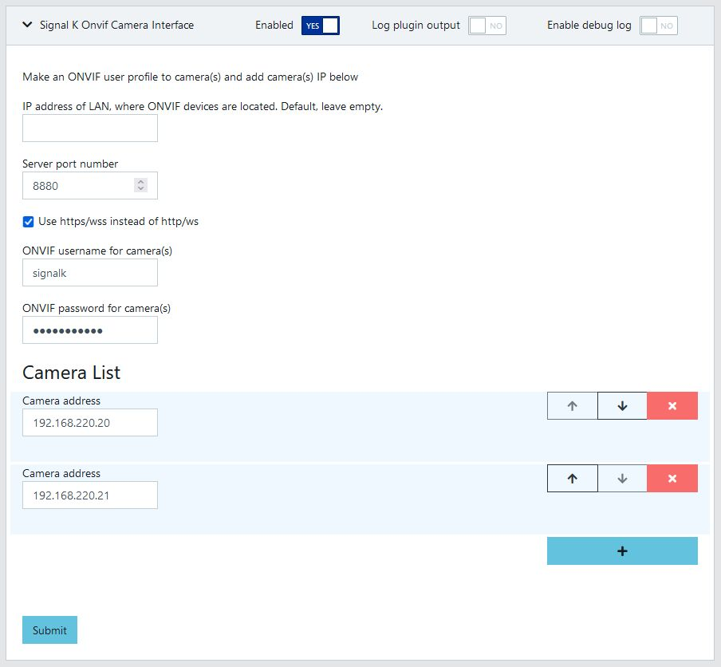

# signalk-onvif-camera

ONVIF Camera interface for Signal K. For IP cameras that support ONVIF control, fixed and PTZ.

## ONVIF Camera plugin config in Signal K server.


- IP address of ONVIF LAN. Default, leave empty
- Select port for server
- Select https/wss if you would like to use secure server
- Enter ONVIF profile username
- Enter ONVIF profile password
- Add camera IP to list (user/pass are used to login to camera)

## ONVIF in IP Camera.

Example of HikVision IP camera ONVIF


- Add ONVIF user to IP camera if applicable

## ONVIF Camera Webapp.


-  Service can be accessed from Webapps menu, press "Signalk-onvif-camera" button 

## ONVIF Camera service.


- ONVIF cameras are searched from local network
- When search is ready then "Select a device" is prompted
- Camera is selected from dropdown menu and then press "Connect" button

## ONVIF Camera in Use.


- Cursors and home button for PTZ camera
- Zoom in/out
- Control speed
- Disconnect
- Hide/show controls 

## Installation

```
$ npm install signalk-onvif-camera --save
```
or
```
$ npm install https://github.com/KEGustafsson/signalk-onvif-camera.git --save
```
## Version control

- v0.0.1, 1st version for testing
- v0.0.2, license added
- v0.1.0, 1st release
- v0.1.1, ONVIF LAN selection
- v0.1.2, Webpack bundled
- v0.1.3, Webapp icon added
- v0.1.4, updated to npm packages
- v0.2.0, hide controls
- v0.2.1, version update
- v0.3.0, ws error handling
- v0.3.1, icon loading error
- v0.4.0, code refactoring
- v0.5.0, improvements to streaming and viewing
- v0.6.0, replace devcert with selfsigned
- v0.6.1, extra console logs removed
- v0.7.0, certs stored to permanent location
- v0.7.1, fix WebSocket connection issues
- v0.8.0, webpack changed to vite

## Credits
https://github.com/futomi/node-onvif 
